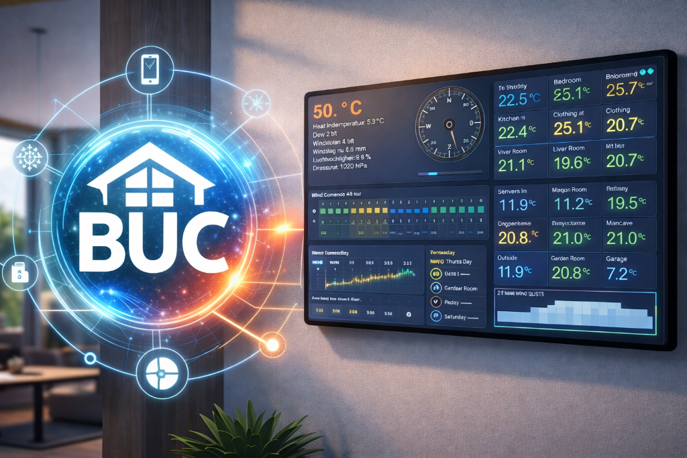

# Brockian Ultra-Cricket (BUC)

**A presentation and rendering framework for Home Assistant and beyond — for people who need more than a Lovelace dashboard.**

## Why this exists

At some point, many Home Assistant setups hit the same wall:

- the data is there
- the automations work
- the integrations are fine
- but the UI is still not quite what you want

Sometimes you want a cleaner weather screen.  
Sometimes you want a wall panel that behaves like an instrument, not a collection of cards.  
Sometimes you want the same information rendered for a browser, an embedded display, or something more specialized.

That is where **BUC** comes in.

BUC is a presentation layer: it sits on top of your data sources and focuses on **how information is shaped, composed, and rendered**.

## What it is for

BUC is meant for people who want to build things like:

- better weather dashboards
- cleaner control room style screens
- energy and system overviews
- touch panels
- embedded display UIs
- dedicated interfaces for specific use cases

It is especially useful when you want more control over layout, rendering, and visual behavior than a standard dashboard normally gives you.

## Why it may be useful to you

BUC is built around a simple idea:

**data collection and UI rendering are different jobs**

If your system already knows things, BUC helps present them in a way that is:

- more deliberate
- more readable
- more device-aware
- more visually consistent
- easier to evolve into something purpose-built

## What makes it different

BUC is not trying to be yet another theme or card pack.

It is about treating UI as its own layer:

- composable
- renderer-aware
- device-aware
- suitable for both general dashboards and highly specific interfaces

If you have ever thought:

> “Home Assistant knows the data, but I want the presentation to be mine.”

then BUC may be useful.

## Current direction

BUC started in the weather-and-panel space, but it is intended to grow beyond that.

The long-term direction is broader:
- weather
- energy
- control systems
- instrumentation-style displays
- alternative frontends for complex installations

In other words:

BUC is for the gloriously convoluted world where data exists, screens matter, and the rules of the game are not always obvious.

## Status

BUC is under active development.

It already proves the core idea:
a separate presentation and rendering layer can produce cleaner, more intentional interfaces than a default dashboard flow.

The details will evolve.  
That is part of the point.

## In one sentence

**BUC exists to give serious tinkerers, builders, and system integrators more control over how their systems are actually seen.**

** Final thought and Warning **
BUC is currently not designed as a hardened public internet frontend.
It does not provide built-in authentication, authorization, or secure remote access features.
If you use BUC outside a trusted local environment, place it behind appropriate access controls such as a VPN, reverse proxy, authentication layer, or other protective infrastructure.

